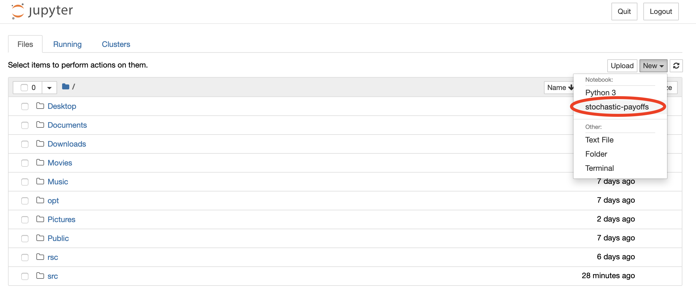

# pd-with-stochastic-payoffs

[](https://github.com/Nikoleta-v3/pd-with-stochastic-payoffs/actions)
<a href="https://github.com/psf/black"></a>


A repository for the project ``The Prisoner's Dilemma with stochastic payoffs''.
A collaboration with [@chilbe3](https://twitter.com/chilbe3) at the
[Max Planck Research Group Dynamics of Social Behavior](https://www.evolbio.mpg.de/socialdynamics).

# Installation and Software

You can copy (clone) the repository locally to your computer by running the
following command in the terminal:

```shell
$ git clone https://github.com/Nikoleta-v3/pd-with-stochastic-payoffs.git
```

Once the repository has been cloned (there is a copy of it on your computer)
navigate to the repository using the terminal.

Once you have navigated to the project, run the command:

```shell
$ conda env create -f environment.yml
```

to install the dependencies. All the dependencies are installed on a `conda`
environment. You can activate the environment by running:

```shell
$ conda activate stochastic-payoffs
```

The environment can also appear in your Jupyter Notebook by running the
following command

```shell
$ python -m ipykernel install --user --name stochastic-payoffs --display-name stochastic-payoffs
```

Your Jupyter Notebook should look like this now:

<p align="center">

</p>

# Tests

The code for the project has been developed using 
[test-driven development](https://en.wikipedia.org/wiki/Test-driven_development).

To run the test suite and the test suite's coverage run the following command
(while the environment is activated):

```shell
$ pytest --cov=src tests/
```

# Licence

The repository is under an MIT licence.

# Contributions

All contributions are welcome, whether they are in the form of code, feedback or
reporting issues.
