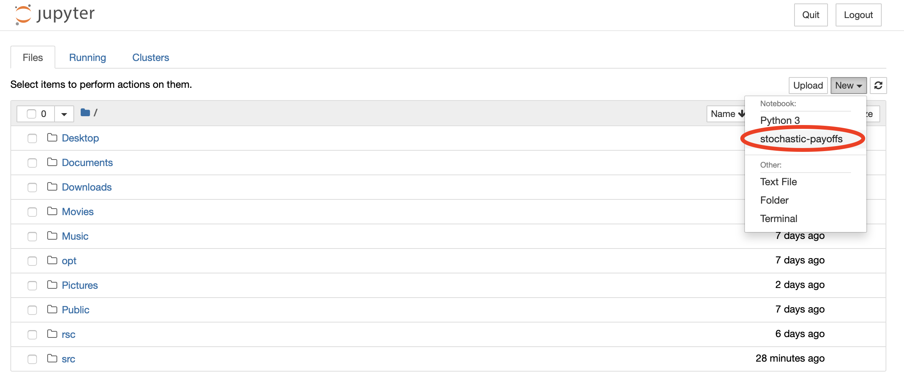

# Evolution of cooperation among individuals with limited updating payoff memory

<a href="https://github.com/psf/black"></a>


A repository for the project ``Evolution of cooperation among individuals with
limited payoff memory''. A collaboration with
[@chilbe3](https://twitter.com/chilbe3) and Alex McAvoy, at the [Max Planck Research Group
Dynamics of Social Behavior](https://www.evolbio.mpg.de/socialdynamics).

# Software

The code for simulating the evolutionary process described in the paper has been
implemented in Matlab. The code used to for the results can be found in the
folder `matlab`.

Matlab is not an open-source language, and for that reason, we have also
implemented the process in Python. Note that the Python code is slower.

## Installation 

For using the source code (Python or Matlab) you will first have to
clone the repository locally to your computer. You just need to run the
following command in the terminal:

```shell
$ git clone git@github.com:Nikoleta-v3/evolution-of-cooperation-with-limited-updating-payoff-memory.git
```

### Python

To install the Python package you need to navigate to the repository using the
terminal. Once you are there run the following command:

```shell
$ python setup.py install
```

# Analysis

Before running the analysis you have to download the simulation data. They are
achieved in Zenodo: https://zenodo.org/record/7664286#.Y_YDWS0w2hk.

The analysis has been carried out in Jupyter Notebooks. We have created an
environment file. To install it navigate to the project using the terminal and
run the command:

```shell
$ conda env create -f environment.yml
```

This installs all the dependencies on a `conda` 
environment. You can activate the environment by running:

```shell
$ conda activate stochastic-payoffs
```

The environment can also appear in your Jupyter Notebook by running the
following command

```shell
$ python -m ipykernel install --user --name stochastic-payoffs --display-name stochastic-payoffs
```

Your Jupyter Notebook should look like this now:

<p align="center">

</p>

From the Jupyter Notebooks navigate to the project and all the notebooks
can be found in the folder `nbs`.

# Tests

The Python code for the project has been developed using 
[test-driven development](https://en.wikipedia.org/wiki/Test-driven_development).

To run the test suite and the test suite's coverage run the following command
(while the environment is activated):

```shell
$ pytest --cov=src tests/
```

# Paper

The paper and supplementary information are written in LaTex. All the
necessary files to compile the documents can be found in the folder `paper`.

# Licence

The repository is under an MIT licence.

# Contributions

All contributions are welcome, whether they are in the form of code, feedback or
reporting issues.
